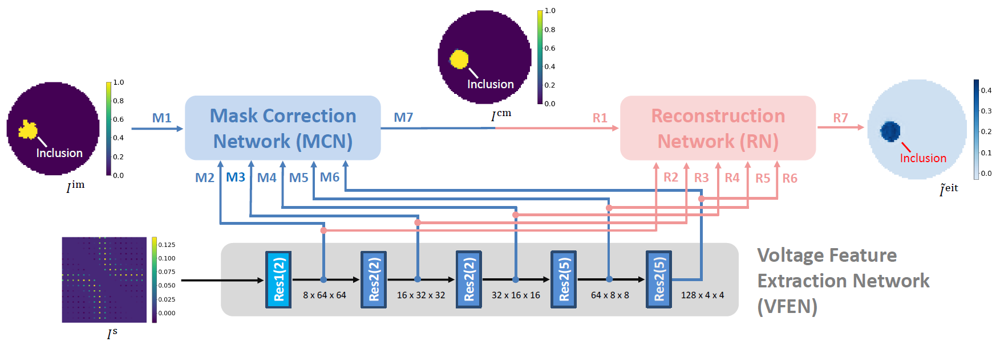

# Enhanced Multi-Scale Feature Cross Fusion Network (En-MSFCF-Net)

Architecture of En-MSFCF-Net

This repository stores the dual-modal deep learning model 'MSFCF-Net' and comparative deep learning models in the paper:

"Z. Liu, P. Bagnaninchi and Y. Yang, "Impedance-Optical Dual-Modal Cell Culture Imaging With Learning-Based Information Fusion," in IEEE Transactions on Medical Imaging, vol. 41, no. 4, pp. 983-996, April 2022, doi: 10.1109/TMI.2021.3129739."

-----------------------------------------------------------------

